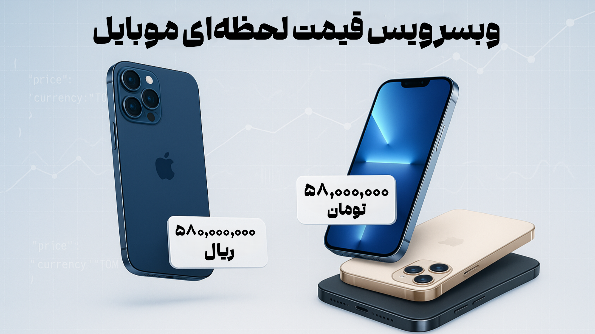

# 📱 وبسرویس قیمت موبایل

<div dir="rtl">



> وب‌سرویس API برای دریافت و نمایش قیمت لحظه‌ای گوشی‌های موبایل از دیجی‌کالا. با قابلیت جستجوی محصولات، نمایش قیمت به ریال و تومان، و خروجی استاندارد JSON. مناسب برای توسعه‌دهندگان و وب‌سایت‌های مقایسه قیمت.

🔍 سرویس API سبک برای دریافت و فرمت‌بندی قیمت گوشی‌های موبایل از دیجی‌کالا

## ⭐ ویژگی‌ها

- 🔍 جستجوی گوشی‌های موبایل بر اساس نام
- 💰 نمایش قیمت به دو صورت ریال و تومان
- 📋 خروجی JSON تمیز و مرتب
- ⚡ مدیریت تعداد درخواست‌ها

## ⚙️ راه‌اندازی

1. 📂 فایل `mobile-price.php` را در سرور PHP خود آپلود کنید
2. ✅ از نصب بودن PHP نسخه 7.4 یا بالاتر اطمینان حاصل کنید
3. 🔌 افزونه cURL را در PHP فعال کنید

## 💻 نحوه استفاده

### 🔎 جستجوی محصولات

```http
GET /?q=iphone&limit=5
```

### ⚡ پارامترها

| پارامتر | نوع     | توضیحات                |
| :-------- | :------- | :------------------------- |
| `q`      | `string` | **اجباری**. عبارت جستجو |
| `limit`  | `number` | تعداد نتایج (اختیاری) |

### 🖼️ دریافت تصاویر

```http
GET /?media=filename.jpg
```

## 📦 نمونه خروجی

```json
{
  "ok": true,
  "product_count": 1,
  "products": [
    {
      "title_fa": "گوشی موبایل اپل مدل iPhone 13",
      "title_en": "Apple iPhone 13 Mobile Phone",
      "brand": "Apple",
      "price": {
        "rial": "52,000,000",
        "toman": "5,200,000"
      },
      "product_thumb": "http://your-domain.com/mobile-price.php?media=image.jpg"
    }
  ]
}
```

## ⚖️ License | مجوز

MIT

## ⚠️ نکته مهم
این سرویس صرفاً برای مقاصد آموزشی طراحی شده است. لطفاً قوانین و محدودیت‌های API دیجی‌کالا را رعایت کنید.

</div> 
